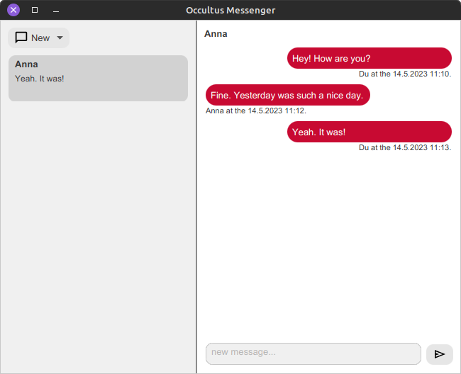

# Occultus Messenger - A Simple PGP Messenger
This project is the result of a school project about encryption with PGP (Pretty Good Privacy).
Encryption is quite important for safe communication on the internet.
PGP makes safe communication possible by the use of a hybrid crypto-system encryption.
That means that an instance has two keys: a private and a public key.

## Important disclaimers
1. This software uses cryptographic software. Some countries restrict the use and/or export of this type of software.
   If you are potentially subject to such restrictions, you should seek legal advice before attempting to develop or
   distribute cryptographic code.
2. This software should not be used for safe communication, not even for any other type of communication.
   It is a school project and its purpose is to demonstrate PGP in communication.

## How does Occultus work?
Occultus is a client software which can encrypt and decrypt using PGPainless. [PGPainless](https://gh.pgpainless.org/)
bases on [Bouncy Castle](https://bouncycastle.org/) and is an "easy-to-use OpenPGP library for Java and Android
applications". Occultus is not finished yet, but I try to extend its functionality.

**Occultus' features:**

- [x] decrypt messages
- [x] encrypt messages
- [x] send messages
- [ ] "Web of Trust" (WoT) implementation
- [ ] manage keys (currently it can only store the user's public and private keys)
- [ ] protect the user's private key

### A short brief into Pretty Good Privacy
PGP is a cryptography software that was invented by Phil Zimmermann in 1991. It was free software and its goal was to
improve email communication security. Now, PGP is not free software anymore. Luckily, there is a free OpenPGP standard.
A lot of encryption software is based on this standard, also PGPainless.

#### Encryption
PGP uses a hybrid crypto-system which means that both, symmetrical and asymmetrical encryption is used.
The message gets symmetrical encrypted with a randomly generated key. Afterwards, the key gets encrypted with an
asymmetrical crypto-system (e.g. RSA). The last step is to send the encrypted key and message in a single package.

## Server software
For sure there is server-side software for this project.
It can be found [here](https://www.github.com/gregor-gottschewski/occultus-server).
Just start the server and run Occultus on your computer and enter the server's IP address and port.

## Build and run Occultus
First, please read the technical information and be sure you have the right requisites installed.
Afterwards, run the following commands from the root directory.

> ⚠️ Use the Maven Wrapper that comes with this project if you haven't Maven installed.

1. `mvn clean package`
2. `mvn install`
3. `mvn javafx:run`

## Technical information
* **JDK Version:** 17.0.6
* **JavaFX Version:** 17.0.7
* **Source code/comments language:** English
* **Application languages:** English, German and French

## License
**MIT License**

> Copyright © 2023 Gregor Gottschewski
>
> Permission is hereby granted, free of charge, to any person obtaining a copy of this software and associated documentation files (the “Software”), to deal in the Software without restriction, including without limitation the rights to use, copy, modify, merge, publish, distribute, sublicense, and/or sell copies of the Software, and to permit persons to whom the Software is furnished to do so, subject to the following conditions:
>
>The above copyright notice and this permission notice shall be included in all copies or substantial portions of the Software.
>
>THE SOFTWARE IS PROVIDED “AS IS”, WITHOUT WARRANTY OF ANY KIND, EXPRESS OR IMPLIED, INCLUDING BUT NOT LIMITED TO THE WARRANTIES OF MERCHANTABILITY, FITNESS FOR A PARTICULAR PURPOSE AND NONINFRINGEMENT. IN NO EVENT SHALL THE AUTHORS OR COPYRIGHT HOLDERS BE LIABLE FOR ANY CLAIM, DAMAGES OR OTHER LIABILITY, WHETHER IN AN ACTION OF CONTRACT, TORT OR OTHERWISE, ARISING FROM, OUT OF OR IN CONNECTION WITH THE SOFTWARE OR THE USE OR OTHER DEALINGS IN THE SOFTWARE.
